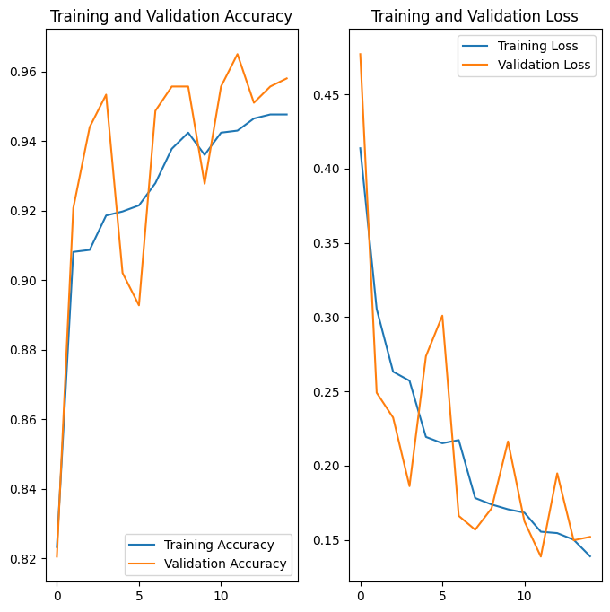
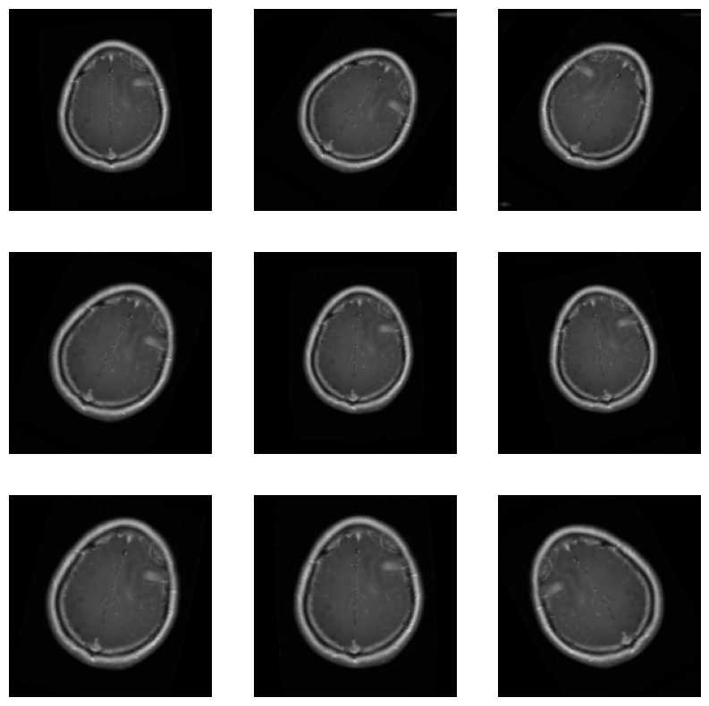

# Image Classification With TensorFlow
## Overview
This project demonstrates a complete workflow for training and evaluating an image classification model using TensorFlow and Keras. The model is built to classify images into different categories using Convolutional Neural Networks (CNNs) and incorporates data augmentation for improved performance.

## Project Structure
- **Data Directory**: Contains images organized in subdirectories for each class.
- **Training and Validation**: Splits data into training and validation sets.
- **Model Building**: Constructs a CNN model and trains it with augmented data.
- **Evaluation**: Evaluates the model and plots training and validation metrics.
- **Prediction**: Loads new images and predicts their classes using the trained model.

## Prerequisites

Ensure you have the following Python packages installed:

- `tensorflow`
- `matplotlib`
- `numpy`

You can install these packages using pip:

```bash 
pip install tensorflow matplotlib numpy
```
## Dataset
Place your image dataset in the data directory, with subdirectories for each class of images. The dataset should be organized as follows:

data/
    Healthy/
        image1.jpg
        ...
    Brain_Tumor/
        image1.jpg
        
## Training and validation accuracy 


## Sample of Dataset


